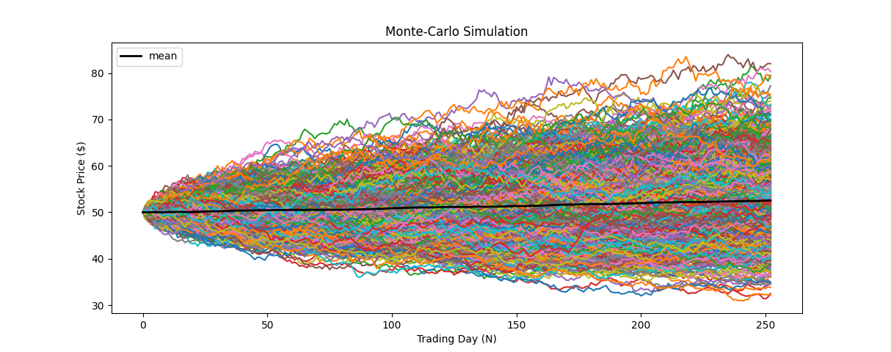

# Black Scholes Model and Monte Carlo Simulation

**An implementation of the famous Black-Scholes Model and Monte Carlo Simulation, which is later combined for Option Pricing**

---

**Theoretical Topics:** *Black-Scholes Model, Monte-Carlo, Options Pricing*

**Tools / Technologies:** *Python, Yahoo Finance, Pandas, Numpy, Datetime*

---

## **Technical Explanation**

1. Monte Carlo Simulation Example -- [MonteCarloBasicExample.py](https://github.com/harshp30/BlackScholesOptionsPricing/blob/main/src/MonteCarloBasicExample.py)

    *What is Monte Carlo?*

    > "The Monte Carlo simulation is a mathematical technique that predicts possible outcomes of an uncertain event."

    In this case we are using Monte Carlo is being used to predict the future value of a stock


    *Setup*
    
    I focused on TSLA stock where we get the stokc price 'today'. In order to run a Monte Carlo Simulation there are various variables. 

    - The price today (S0)
    - Simulation time length (N = 252 -- Number of trading days in a year)
    - Number of iteration (simulation_iterations = 1000)
    - mu (mu = 0.0002)
    - sigma (sigma = 0.01)

    The code below is represntation of this and essential calculates the stock price of each of the next 252 trading days a thousand times using the Monte Carlo formula

    The `prices[-1] * np.exp((mu - 0.5 * sigma ** 2) + sigma * np.random.normal())` formula is used to calculate the stock price. It based on Ito Lemma stochastic process iwth the Wiener-process in a random walk


     ```
    for _ in range(simulation_iterations):
        prices = [S0]
        for _ in range(N):
            stock_price = prices[-1] * np.exp((mu - 0.5 * sigma ** 2) + sigma * np.random.normal())
     ```

    *Plot*

    In the plot below we have a representation of each of the simulation iterations and a mean (black line) representing the average of these simulations. The mean is what is used as the final result.

    

    &nbsp;

2. Black Scholes Model Example -- [BlackScholesBasicExample.py](https://github.com/harshp30/BlackScholesOptionsPricing/blob/main/src/BlackScholesBasicExample.py)

    *What is Black-Scholes Model?*

    > The Black-Scholes Model is a mathematical formula with can used to calculate option contract prices

    In this case we are using Black Scholes is being used for the purpose of pricing call (right to buy) and put (right to sell) options


    *Setup*
    
     I focused on CCF stock where we get the stokc price 'today'. In order to use the Blac-Scholes model there are various variables. 

     - The price today (S0)
     - the strike price (E -- the price at which a put or call can be exectued)
     - Expiry (T -- Set to 1 year / 365 days)
     - Risk-Free Rate (rf -- The market risk free rate for the USA)
     - Volatility (sigma -- a standard deviation of the log returns which calculates the volatility of the underlying stock)

    With the Black-Scholes model we have to caulcate two additional parameters `d1` and `d2`. 

    `d1 = (log(S/E)+(rf+sigma*sigma/2.0)*T)/(sigma*sqrt(T))`

    `d2 = d1-sigma*sqrt(T)`

    These two equations help solve the black-Scholes equation itself. After all of these variables are declared and calculated we can price call and put options as follows.

    ```
    # Call Option Pricing
    S*stats.norm.cdf(d1)-E*exp(-rf*T)*stats.norm.cdf(d2)

    # Put Option Pricing
    -S*stats.norm.cdf(-d1)+E*exp(-rf*T)*stats.norm.cdf(-d2)
    ```
         
    &nbsp;

3. Black Scholes Monte Carlo Implementation -- [BlackScholesMonteCarloImplementation.py](https://github.com/harshp30/BlackScholesOptionsPricing/blob/main/src/BlackScholesMonteCarloImplementation.py)

    This is the combined implementation between Monte Carlo Simulation and Black-Scholes Option Pricing. In this code we start with an initial price of CCF stock ($101.38), set a strike price ($95) and after running the Monte Carlo simulation for 2000 interations we end up with:
    
    - Value of call option: $13.18
    - Value of put option: $3.83

    The formulation if very similar to the equations shown above in the first two basic exmaples. Instead of directly returning the call and put option prices we retun the mean of these prices as per the 2000 iterations. This leads to theoretically a more accurate result.    

    These code for be used ot run a simulation on any stock. The stock can be passed in through the `get_data()` call. Then the strike price and number of itertaions is inputted by the user

    ```
    strike_price = float(input('Select the Strike Price: $'))
    iterations = int(input('How many iterations would you like to run the simulation for? '))
    ```

---

### **Next Steps**

- This project could be expanded to an actual application where users could input a stock of there choice and see option pricing

---

### **Additional Notes**

- Yahoo Finance used to extract stock data
- Numerical Results of the model is attached in [results.txt](https://github.com/harshp30/BlackScholesOptionsPricing/blob/main/Results.txt)


