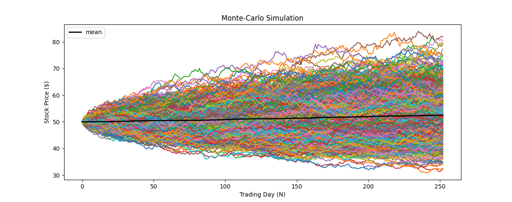

# Black Scholes Model and Monte Carlo Simulation

**An implementation of the famous Black-Scholes Model and Monte Carlo Simulation, which is later combined for Option Pricing**

---

**Tools / Technologies:** *Python, Yahoo Finance, Pandas, Numpy, Datetime*

---

### Technical Explanation:

1. Monte Carlo Simulation Example || [MonteCarloBasicExample.py](https://github.com/harshp30/BlackScholesOptionsPricing/blob/main/MonteCarloBasicExample.py)

    Hold

    

2. Black Scholes Model Example || [BlackScholesBasicExample.py](https://github.com/harshp30/BlackScholesOptionsPricing/blob/main/BlackScholesBasicExample.py)

    Hold

2. Black Scholes Monte Carlo Implementation || [BlackScholesMonteCarloImplementation.py](https://github.com/harshp30/BlackScholesOptionsPricing/blob/main/BlackScholesMonteCarloImplementation.py)

    Hold

---

### Areas of Improvement:

- Yahoo Finance is not the best source for data
- 

---

### Additional Notes:

- Results of the model is attached in [results.txt](https://github.com/harshp30/BlackScholesOptionsPricing/blob/main/Results.txt)

